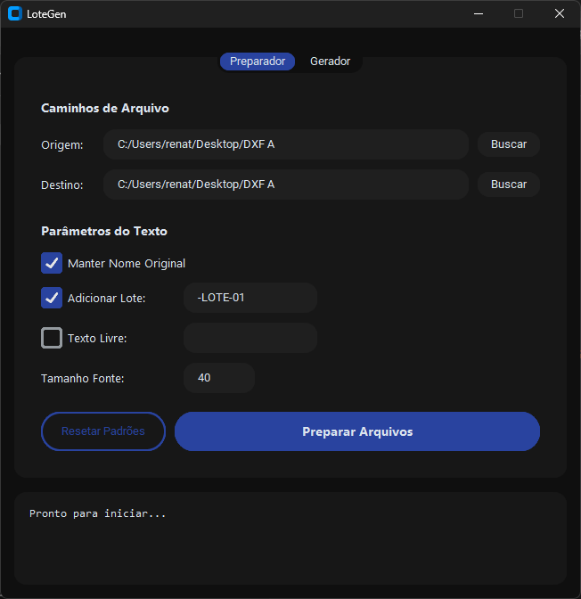
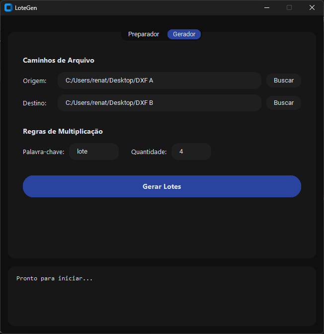

# LoteGen

Ferramenta de interface gráfica desenvolvida em Python para automação, preparação e multiplicação de lotes em arquivos CAD (.dxf). Desenvolvido para eliminar tarefas repetitivas na exportação de peças.

### Preparador
Insere sufixos de lote, textos livres e formata a geometria do texto de forma automatizada.

### Gerador
Multiplica arquivos baseados em palavras-chave e numeração em lote, sem corromper as propriedades originais do CAD.

**Download**
O executável (.exe) pronto para uso corporativo no Windows está disponível na aba **Releases** na lateral direita desta página. Não requer instalação do Python.

**Stack**
Python | ezdxf | CustomTkinter
